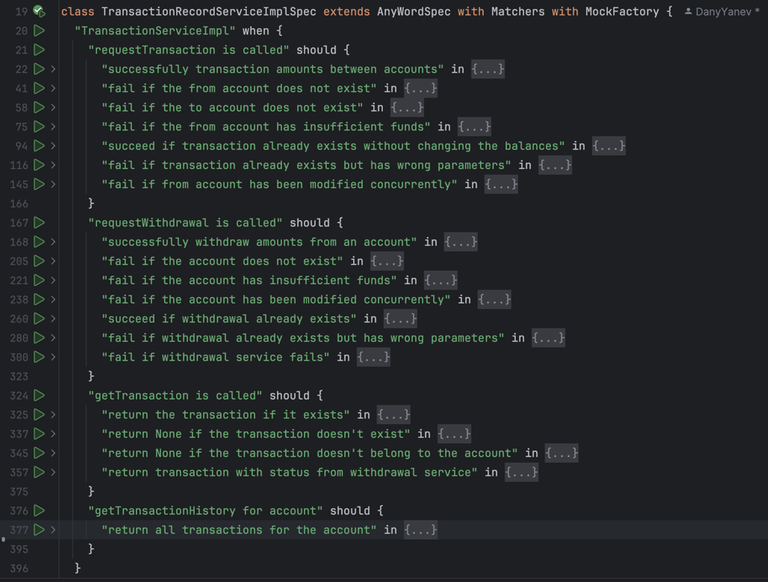

# Intro

I've implemented the service in Scala (2.13.14) with sbt (1.10.0) & Java SDK 20

Used standard Scala functional libraries like http4s, cats, circe etc.

Postman collection with example requests is available in /docs/
Wanted to include swagger route, but that would've required tapir some refactoring

## The project is structured in the following way:

```
   /src
      /main
         /scala
            /core - common DTOs - Address, Amount
            /account
               /storage - in-memory storage for accounts
            /transactions
               /controllers - http4s controllers (calls service)
                  /models - request/response models
               
               /service - Business logic (calls storage and withdrawal service)
                  /models - transaction objects with status
               
               /storage - in-memory storage for transactions
                  /models - transaction objects stored in the "database"
               
            /withdrawal.scala - Scala wrapper of Java withdrawal service
         /java
            /withdrawal.java - Java withdrawal service (provided)
*Note unfortunately scala and java prefixes dont contribute to the package route, 
   so I had to postfix them to distinguish between both withdrawal packages.
```

### The 3 main transactions packages - controller, service, storage each implement their own DTOs.

Unit tests for TransactionService are available in `TransactionServiceImplSpec.scala`

Scenarios explain well what how the service behaves.


Contract tests for TransactionController are available in `TransactionControllerSpec.scala`

## Some notes:

1. Service implements idempotency and the transactionId creation is left to the clients.

   This allows clients to retry transactions safely.
2. The service is stateless
3. The service handles concurrent writes and reads safely. Concurrent writes are error-ed out. It's possible to retry
   those errors, but that is left out of the implementation.
   The storage uses optimistic locking on a `version` field.

   This allows the clients of the storage to write safely only if the **underlying object hasn't changed concurrently**.

   See `AccountStorageImpl.scala`
4. Most design decisions were future proofed, although probably there was no need for this project
5. There is a serious issue arising from not having something like transactions for my in-memory stores.

   Explained in detail in `TransactionServiceImpl.scala`
6. Not all tests scenarios were implemented in the contract tests.

   The contract tests came out a bit verbose, there are better ways to write them.

   Tapir would've helped with that, but I didn't want to add more dependencies and rework current controller.

   Tapir would've also provided swagger files. Routes available in `*Controller`.
7. AccountStorage uses defaults as no endpoints for managing accounts are provided.

   See `account/storage/DefaultValues`
8. Because there are no routes for account its difficult to test things like correct amount deduction.

   See `TransactionServiceImplSpec.scala`
9. The insides of the services aren't using IO, which in practice would be the case. Code wouldn't be much different.
10. Amount class is Int for ease of use
11. API Errors could be more descriptive, but left them as statuses for simplicity
12. Java WithdrawalStub is wrapped in a scala class.
13. Failed withdrawals are not credited back to the account, as this would be hacky without changing the design of the
    provided stub.
14. Using Either almost everywhere from the beginning turned out to be a pain in the ass.

Having concrete error types is very useful if you want to react to individual errors and have rich errors, but it makes
the code very verbose, and you have to deal with wrapping and huge pattern matching.

## If you have any questions or need more information, feel free to drop me an email :)

Endpoints:
`TransactionController.scala`

``` scala
    case req@POST -> Root / "accounts" / UUIDVar(accountId) / "transactions" / "internal" =>
      req.decode[InternalTransactionRequest](requestInternalTransaction(accountId, _))

    case req@POST -> Root / "accounts" / UUIDVar(accountId) / "transactions" / "withdrawal" =>
      req.decode[WithdrawalRequest](requestWithdrawal(accountId, _))

    case GET -> Root / "accounts" / UUIDVar(accountId) / "transactions" =>
      getAllTransactions(accountId)

    case GET -> Root / "accounts" / UUIDVar(accountId) / "transactions" / UUIDVar(transactionId) =>
      getTransaction(accountId, transactionId)
```

Improvements:

1. The endpoint that returns transactions for account should return all transaction the account is involved in, not just
   the ones initiated by the account.
2. Transaction should be able to be fetched by ID by either initiator or recipients accountID.
   Right now only initiator can fetch that transaction. (same issue as above)
